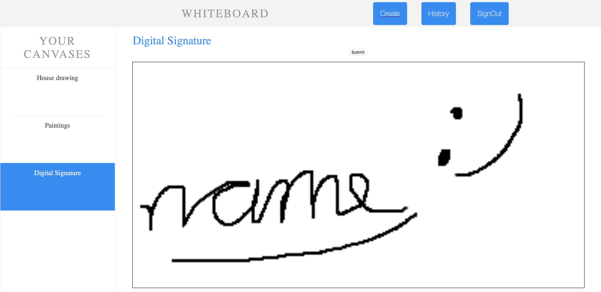

# Whiteboard
A collaborative editable canvas

# Team Members
Chris Coraggio, Front End Developer, ccoraggi@purdue.edu  
Zoe Arbuckle, Middleware/Deployment, zarbuckl@purdue.edu  
Noah Franks, Backend Developer, nfranks@purdue.edu  

# Description
Whiteboard brings the efficiency of collaboration to the freedom of drawing. Users can create and join a board, where each user on the board can introduce their strokes in real time. A history of strokes and erasures is kept to know how the document changes over time. Whiteboard is the solution to brainstorming in a virtual meeting or working on a project with elements that are hard to type.  

# Technologies
MariaDB - Opensource mysql database  
Node.js - Server functionality  
React - Framework for the web canvas  
PubNub - An api for concurrent messaging  

